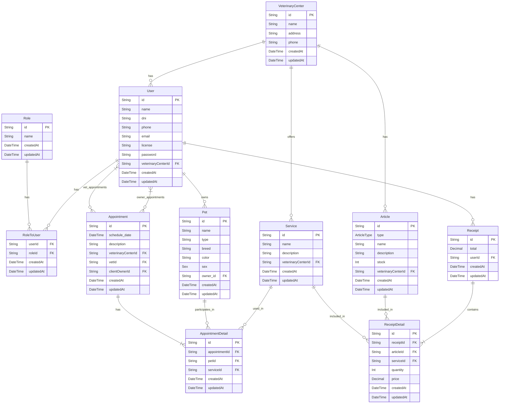

```mermaid
erDiagram
    Role {
        String id PK
        String name
        DateTime createdAt
        DateTime updatedAt
    }

    User {
        String id PK
        String name
        String dni
        String phone
        String email
        String license
        String password
        String veterinaryCenterId FK
        DateTime createdAt
        DateTime updatedAt
    }

    RoleToUser {
        String userId FK
        String roleId FK
        DateTime createdAt
        DateTime updatedAt
    }

    VeterinaryCenter {
        String id PK
        String name
        String address
        String phone
        DateTime createdAt
        DateTime updatedAt
    }

    Pet {
        String id PK
        String name
        String type
        String breed
        String color
        Sex sex
        String owner_id FK
        DateTime createdAt
        DateTime updatedAt
    }

    Appointment {
        String id PK
        DateTime schedule_date
        String description
        String veterinaryCenterId FK
        String vetId FK
        String clientOwnerId FK
        DateTime createdAt
        DateTime updatedAt
    }

    AppointmentDetail {
        String id PK
        String appointmentId FK
        String petId FK
        String serviceId FK
        DateTime createdAt
        DateTime updatedAt
    }

    Article {
        String id PK
        ArticleType type
        String name
        String description
        Int stock
        String veterinaryCenterId FK
        DateTime createdAt
        DateTime updatedAt
    }

    Service {
        String id PK
        String name
        String description
        String veterinaryCenterId FK
        DateTime createdAt
        DateTime updatedAt
    }

    Receipt {
        String id PK
        Decimal total
        String userId FK
        DateTime createdAt
        DateTime updatedAt
    }

    ReceiptDetail {
        String id PK
        String receiptId FK
        String articleId FK
        String serviceId FK
        Int quantity
        Decimal price
        DateTime createdAt
        DateTime updatedAt
    }

    Role ||--o{ RoleToUser : "has"
    User ||--o{ RoleToUser : "has"
    User ||--o{ Pet : "owns"
    User ||--o{ Receipt : "has"
    User }|--o{ Appointment : "vet_appointments"
    User }|--o{ Appointment : "owner_appointments"
    VeterinaryCenter ||--o{ User : "has"
    VeterinaryCenter ||--o{ Service : "offers"
    VeterinaryCenter ||--o{ Article : "has"
    Appointment ||--|{ AppointmentDetail : "has"
    Pet ||--o{ AppointmentDetail : "participates_in"
    Service ||--o{ AppointmentDetail : "used_in"
    Service ||--o{ ReceiptDetail : "included_in"
    Article ||--o{ ReceiptDetail : "included_in"
    Receipt ||--|{ ReceiptDetail : "contains"
```